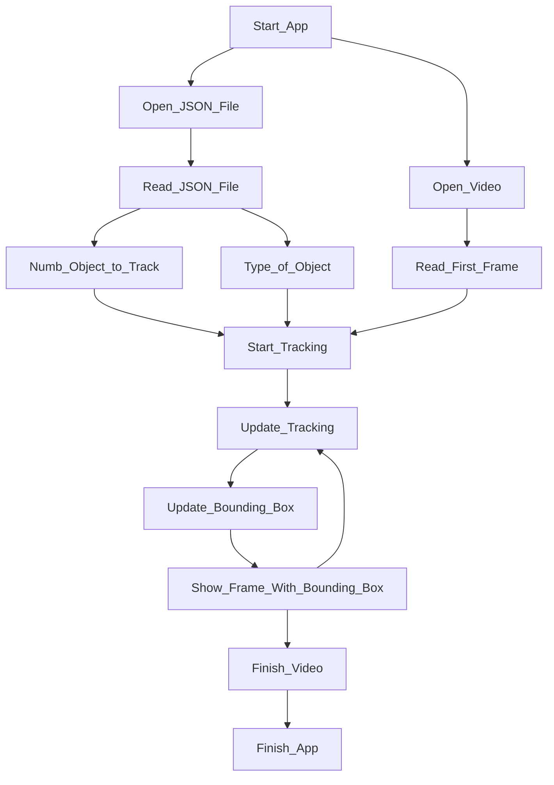

# MLE_Object_Tracking
---
## Introduction:
The following code tracking objects in a video. To do this uploads the video and takes from a JSON file the number and initial position of the objects to be tracked.

## Flow chart



## Requirements:
1. Python (3.9)
2. OpenCV (4.2)

    ### Conda environment:
    If you use conda you can import the environment of this project.
    ```bash
    conda env create -f environment.yml
    ```
    And then activate the conda environment
    ```bash
    conda activate Epic_iO
    ```
    
## Commands to run tracking by terminal:
  To run this code is necessary to put the following parameters in the terminal:
 * -j = full path of json file
 * -v = full path of video
 * -t = type of tracking (csrt or kcf)

Open a terminal in the folder of project and type:

```bash
python ./main.py -j "Full path of json file" -h "Full path of video" -t "csrt or kcf"
```
## Commands to run tracking with Docker:
   ### Requirements:
    1. Docker
    2. VNC viewer

To view the output of the application it is necessary the "VNC viewer", if you don't have the application you can download the program from [here](https://www.realvnc.com/es/connect/download/viewer/) and run the following command
```bash
sudo dpkg -i /home/${USER}/Downloads/VNC-Viewer-6.22.315-Linux-x86.deb
```
After it is neccessary build the Dockerfile with the following command:
```bash
docker build -t object_tracking .
```
When the build ends, open a terminal in the work directory and run the container and after that in another terminal run the VNC viewer to view the container's output.
```bash
docker run --rm -v ${PWD}:/src -e JSONFILE="Name of json file" -e VIDEOFILE="Name of video" -e TRACK="csrt or kcf"  object_tracking
```
```bash
vncviewer 172.17.0.2:5900
```
## Commands to run tracking with docker-compose:
   ### Requirements:
    1. docker-compose
    2. VNC viewer
With the same instructions to execute with docker run, with docker-compose you need to execute the only following two commands.
```bash
docker-compose up
```
```bash
vncviewer 172.17.0.2:5900
```
